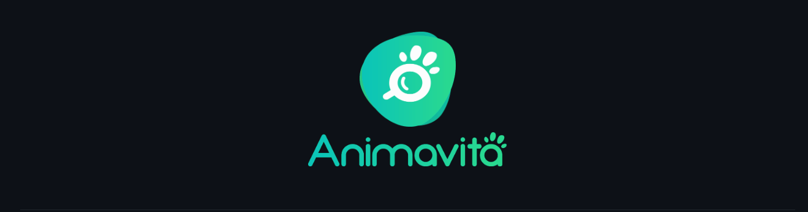

# Projeto com README
Um projeto de testo com um arquivo README 😶‍🌫️📄

[](https://google.com)

## Tecnologias utilizadas
- HTML
- CSS
- JS

## Como utilizar

1 - Clone pro o projeto
```
git clone <url do projeto>
``` 
2 - Acesse a pasta do projeto
```
cd repositorio-com-readme
``` 